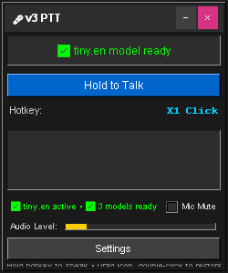
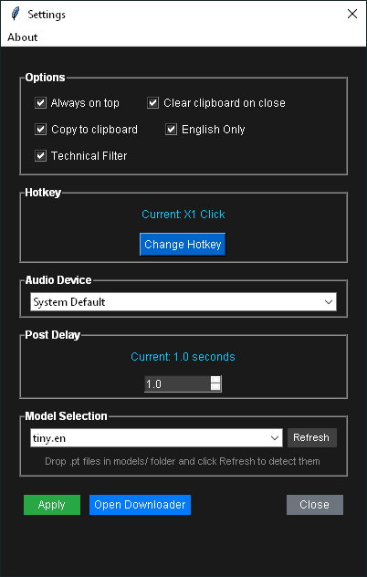

# 🎙️ LoudMouth - Privacy-First Voice-to-Text

> **Offline, fast, and developer-friendly voice-to-text application powered by OpenAI Whisper**

[](https://opensource.org/licenses/MIT)
[](https://www.python.org/downloads/)
[](https://github.com/yourusername/LoudMouth)

**✨ [Download Latest Release](https://github.com/Sggin1/LoudMouth/releases) | 📖 [Documentation](./docs/) | 💬 [Issues](https://github.com/Sggin1/LoudMouth/issues) | ☕ [Support Development](https://ko-fi.com/YOURKOFIUSERNAME)**

---

## 🚀 Features

- **🔒 100% Offline** - No internet required, complete privacy
- **⚡ Lightning Fast** - Optimized for short audio clips
- **🎯 Developer-Focused** - Technical filter converts "underscore" → "_", "dot py" → ".py"
- **🎛️ Customizable** - Multiple models, hotkeys, and settings
- **🖥️ Cross-Platform** - Windows, macOS, Linux support
- **🎪 Easy to Use** - Simple push-to-talk interface

## 📸 Screenshots





## 🎯 Why LoudMouth?

**Privacy Matters**: Unlike cloud-based solutions, LoudMouth processes everything locally  
**Speed**: No network delays, instant transcription  
**Accuracy**: Choose from multiple Whisper models based on your needs  
**Developer-Friendly**: Built-in technical vocabulary for programming  

## 📦 Quick Start

### Option 1: Download Pre-built Binary
1. Go to [Releases](https://github.com/Sggin1/LoudMouth/releases)
2. Download for your platform:
   - `LoudMouth-Windows.exe` for Windows
   - `LoudMouth-Linux` for Linux
   - `LoudMouth-macOS` for macOS
3. Run and enjoy!

### Option 2: Run from Source
```bash
git clone https://github.com/Sggin1/LoudMouth.git
cd LoudMouth
pip install -r requirements.txt
python main.py
```

## 🛠️ System Requirements

- **Python 3.8+** (for source installation)
- **2GB RAM minimum** (4GB recommended)
- **Microphone** (obviously!)
- **500MB disk space** (for models)

## ⚙️ Available Models

| Model | Size | Speed | Accuracy | Best For |
|-------|------|-------|----------|----------|
| tiny | ~150MB | ~10x | Basic | Quick notes |
| base | ~290MB | ~7x | Good | General use |
| small | ~967MB | ~4x | Better | Most users |
| medium | ~3.0GB | ~2x | Very Good | High accuracy |
| large | ~6.0GB | 1x | Best | Professional use |

## 🔧 Configuration

### Hotkeys
- Default: `Shift` (hold to record)
- Supports: Keyboard keys, mouse buttons
- Customizable in settings

### Technical Filter
Perfect for developers! Converts spoken words to code:
- "underscore" → "_"
- "dot py" → ".py"  
- "open paren close paren" → "()"
- "equals equals" → "=="
- And 100+ more conversions!

## 🤝 Contributing

We welcome contributions! Here's how to help:

1. **🐛 Report Bugs** - Use the [Issues](https://github.com/Sggin1/LoudMouth/issues) tab
2. **💡 Suggest Features** - We love new ideas!
3. **🔧 Submit PRs** - Check our [Contributing Guide](CONTRIBUTING.md)
4. **📖 Improve Docs** - Documentation is always appreciated

## 💖 Support Development

LoudMouth is free and open source. If you find it useful, consider supporting:

- ⭐ **Star this repository** (helps others discover it)
- ☕ **[Buy me a coffee](https://ko-fi.com/sggin1)** (one-time support)
- 💝 **[GitHub Sponsors](https://github.com/sponsors/Sggin1)** (monthly support)
- 🐦 **Share on social media** (spread the word!)

## 📋 Roadmap

- [ ] **v1.x** - two parallel pipeline
- [ ] **v1.x** - button release routes audio to command buffer
- [ ] **v1.x** - async command injection " 
   spoken = "space 5, copy 7, enter , paste
   Output: 'Space', 'Space', 'Space', 'Space', 'Space', 'Copy( next 7 chars)','enter', paste
- [ ] **v2.x** - lightweight translucent UI overlay

## 🔧 Building from Source

```bash
# Install build dependencies
pip install pyinstaller

# Build executable
pyinstaller --onefile --windowed --name="LoudMouth" main.py

# Find your executable in dist/
```

## 📄 License

This project is licensed under the MIT License - see the [LICENSE](LICENSE) file for details.

## 🙏 Acknowledgments

- **OpenAI** for the incredible Whisper model
- **Contributors** who make this project better
- **Users** who provide feedback and support

---

**Made with ❤️ for developers who value privacy and efficiency**

[Report Bug](https://github.com/sggin1/LoudMouth/issues) · [Request Feature](https://github.com/sggin1/LoudMouth/issues) · [Discussions](https://github.com/sggin1/LoudMouth/discussions)
